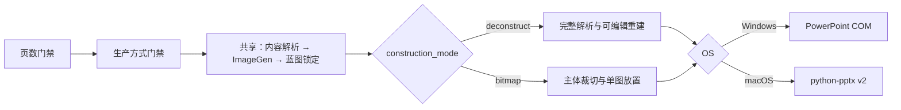
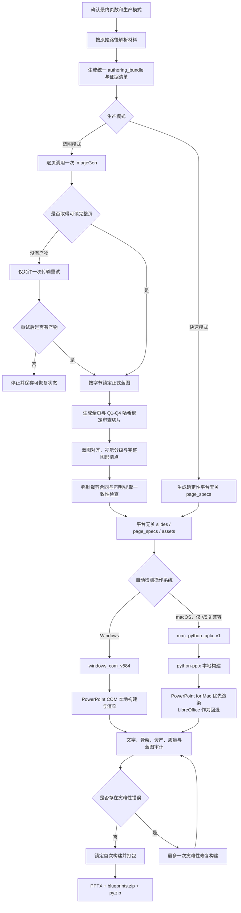

# Standard Report PPT V6.0.0-rc1

[中文说明](#中文说明) · [English](#english)

Standard Report PPT 是一个面向 Codex 的固定模板咨询报告 PPT Skill，可将 DOCX、PDF、研究材料、数据、笔记或已有演示文稿转换为可编辑 PowerPoint。

V6 保持蓝图锁定前的内容生产链不变，取消 V6 新项目的快速模式，新增两种必须显式选择的蓝图后构建方式：较慢但可编辑的解构模式，以及较快、主体不可编辑的位图模式。V5.9.x 项目继续按原合同运行。

## Blueprint showcase / 蓝图效果展示

以下三张蓝图沿用原仓库展示素材。最终 PPT 中的文字、数字、图表、表格和基础图形由本地运行时重建为可编辑对象。

### S01 — Core material performance / 核心材料性能


### S02 — Value chain and material matrix / 产业链与材料矩阵


### S03 — Market size and regional opportunities / 市场规模与区域机会


---

## 中文说明

### V6 生产方式门禁

1. `解构模式（较慢）：逐页拆解蓝图并重建为可编辑 PPT；复杂非原生视觉可保留为局部位图。`
2. `位图模式（较快）：章节、标题、核心判断、来源和页码可编辑；主体蓝图裁切后作为不可编辑图片放入。`

两种方式都必须调用 ImageGen、逐页锁定正式蓝图；ImageGen 不可用时停止，不允许位图模式绕过蓝图，也不允许解构模式自动降级。Windows 使用 `windows_com_v584`，macOS 使用 `mac_python_pptx_v2`。两端解构模式在蓝图锁定后共同执行 G0–G3 视觉普查、全页和 Q1–Q4 审查、原子级局部裁切及图片无轮廓门禁；Mac 另外阻断裁切像素中的完整深色外围框线。

### V6.0.0-rc1 最新状态

- Mac 解构模式现已强制执行 G0–G3 视觉普查、全页和 Q1–Q4 哈希绑定审查，并拒绝包含多主体、可编辑文字或原生几何的大块复合裁切。
- Windows 与 Mac 解构成品都会审计图片轮廓；Mac 编译器还会阻断裁切 PNG 中已经烘焙进去的完整深色外围框线。
- 位图模式继续保留五层原生可编辑骨架，每页仅放置一个等比例、无轮廓的主体图片；核心判断每段严格只有一个 `■`。
- 发布源和本地安装路径已完成 376 项自动化测试；Windows 专属 COM 构建算法与蓝图生成前冻结链路未改变。
- 当前仍为 RC：真实 PowerPoint for Mac 冒烟测试尚未完成，因此尚未标记正式 `V6.0.0`。



### V5.9.6 兼容说明（仅旧项目）

- **两个入口门禁**：只需明确最终页数和生产模式，之后直接执行完整制作流程。
- **蓝图模式**：每页调用一次 ImageGen，生成结果按字节锁定为正式蓝图；已有蓝图不会因文字、美观或相似度问题自动重做。
- **旧项目快速模式**：仅 V5.9.x 项目保留；V6 新项目不显示也不接受该选项。
- **视觉优先路由**：根据证据选择图表、结构图、视觉节点链、图文比较、查询表、真实流程或叙事模块，不用固定卡片网格套版。
- **V5.9.6 四象限审查**：正式蓝图锁定后自动生成全页和 Q1–Q4 审查切片，并用 SHA-256 绑定蓝图，避免遗漏底部、边角和小尺寸图形。
- **强制图形裁剪合同**：`icon`、`pictogram`、`logo`、`map`、`photo`、`illustration`、`device`、`person`、`product`、`flag` 必须形成真实裁剪资产，不能用 `native` 或 `omit` 绕过。
- **三方数量审计**：强制要求声明数 = 提取数 = PPT 插入数；漏裁、漏插、重复插入或位置越界都会阻止打包。
- **首次构建锁定**：普通留白、缩放、排版和蓝图相似度差异只产生警告，不触发无意义的美化返工；只有灾难性合同错误允许一次修复构建。
- **跨平台本地构建**：同一份内容、蓝图、对齐记录和 `page_specs` 自动路由到 Windows COM 或 macOS python-pptx 后端。
- **可编辑交付**：正文、数字、图表、表格和基础几何保持 PowerPoint 原生可编辑；只有审查确认的非原生视觉作为独立图片资产插入。
- **确定性编译**：整份演示文稿由一个根目录 `generate_deck.py` 构建，不生成逐页脚本。

### V5.9.6 旧项目工作流（兼容参考）



### 平台运行路径

#### Windows

运行路径：

```text
统一内容与蓝图
  → 平台无关 page_specs
  → windows_com_v584
  → Microsoft PowerPoint COM 构建
  → PowerPoint 渲染
  → 审计与三文件交付包
```

要求：

- Windows 10/11
- Microsoft PowerPoint 桌面版
- Python 3.12
- Codex 桌面端或其他可加载本地 Skill 的 Codex 环境
- 蓝图模式需要可用的 ImageGen

Windows 安装：

```powershell
git clone https://github.com/edchwx-lang/standard-report-ppt.git "$HOME\.codex\skills\standard-report-ppt"
```

如目录已存在：

```powershell
git -C "$HOME\.codex\skills\standard-report-ppt" pull
```

#### macOS（V6 默认路径）

运行路径：

```text
统一内容与蓝图
  → 平台无关 page_specs
  → mac_python_pptx_v2
  → python-pptx 本地构建
  → PowerPoint for Mac 渲染（优先）或 LibreOffice 回退
  → 审计与三文件交付包
```

macOS 不使用 PowerPoint COM。要求：

- macOS
- Python 3.12
- PowerPoint for Mac，或用于回退渲染的 LibreOffice
- Codex 桌面端或其他可加载本地 Skill 的 Codex 环境
- V6 解构模式和位图模式都需要可用的 ImageGen

macOS 安装：

```bash
git clone https://github.com/edchwx-lang/standard-report-ppt.git "$HOME/.codex/skills/standard-report-ppt"
```

如目录已存在：

```bash
git -C "$HOME/.codex/skills/standard-report-ppt" pull
```

如果 PowerPoint for Mac 和 LibreOffice 均不可用，管线可生成结构有效但未渲染验证的本地 PPTX；此状态不会生成已验证的三文件 ZIP。

### 使用方式

```text
$standard-report-ppt 用这份报告做3页PPT，解构模式
$standard-report-ppt 用这份报告做5页PPT，位图模式
```

也可以先提供材料，再按提示选择：

```text
1. 解构模式（较慢）：逐页拆解蓝图并重建为可编辑 PPT；复杂非原生视觉可保留为局部位图。
2. 位图模式（较快）：章节、标题、核心判断、来源和页码可编辑；主体蓝图裁切后作为不可编辑图片放入。
```

最终页数和生产方式是仅有的常规用户确认。V6 两种方式都必须先完成内容解析和 ImageGen 蓝图锁定；单独选择“蓝图模式”无效。完整合同、视觉规则和兼容行为见 [SKILL.md](SKILL.md)。

### 项目管线命令

以下命令用于调试或手动运行已经准备好的项目；普通 Codex 使用无需逐条执行：

```powershell
python scripts/project_pipeline.py <project> --init
python scripts/project_pipeline.py <project> --materialize
python scripts/project_pipeline.py <project> --prepare-visual-review
# 位图模式改用：
python scripts/project_pipeline.py <project> --prepare-bitmap-review
python scripts/project_pipeline.py <project> --compile
python scripts/project_pipeline.py <project> --run --output <project>/output/report.pptx
```

`--prepare-visual-review` 用于 V6 解构模式（以及 V5.9.6 旧项目蓝图模式），在正式蓝图锁定后生成全页与 Q1–Q4 哈希绑定审查；V6 位图模式必须使用 `--prepare-bitmap-review`，只做逐页全图审查。

Windows 外部端到端冒烟已验证 V6 解构、位图两种模式均可由 PowerPoint COM 成功构建。真实 PowerPoint for Mac 冒烟通过前，版本仍标记为 `V6.0.0-rc1`。

> V5.9 兼容路径仍使用 `mac_python_pptx_v1`，并仅对 V5.9.x 旧项目保留 `fast`；它们不是 V6 默认路径。

### 验证

```powershell
python -m unittest discover -s tests -p "test_*.py"
```

V5.9.6 发布回归包含 V5.1–V5.9.6 兼容测试、Windows/macOS 后端测试、蓝图锁定测试、裁剪合同测试和最终 PPT 资产审计。

### 目录结构

```text
standard-report-ppt/
├─ SKILL.md
├─ agents/
├─ assets/
├─ docs/images/
├─ prompts/
├─ references/
├─ scripts/
├─ tests/
├─ requirements-windows.lock
└─ requirements-macos.lock
```

---

## English

### V6 construction gate

Every new V6 project must explicitly select one of these post-blueprint routes:

1. Deconstruct (slower): parse each blueprint and rebuild an editable PPT; one
   bounded local bitmap may remain for a genuinely non-native visual subject.
2. Bitmap (faster): keep chapter, title, core judgment, source, and page number
   editable, then place one reviewed cropped body image.

Both routes require built-in ImageGen and one immutable blueprint per page.
Windows uses `windows_com_v584`; macOS uses `mac_python_pptx_v2`. No route may
silently switch to the other.

### Latest V6.0.0-rc1 status

- Mac deconstruction now enforces the G0–G3 visual census and hash-bound full-page plus Q1–Q4 review, and rejects composite crops containing multiple subjects, editable text, or native geometry.
- Both deconstruction backends audit picture outlines. The Mac compiler also blocks a complete dark perimeter frame already baked into a cropped PNG.
- Bitmap construction retains five native editable skeleton layers and inserts exactly one aspect-preserving, outline-free body image per page. Every core-judgment paragraph contains exactly one `■`.
- The release source and installed skill pass 376 automated tests. The Windows COM construction algorithm and all frozen pre-blueprint stages remain unchanged.
- This remains an RC: the real PowerPoint for Mac smoke test remains pending, so the release is not yet labeled final `V6.0.0`.

### V5.9.6 compatibility for existing projects

- Two intake gates: the exact final slide count and production mode.
- Blueprint mode: one successful ImageGen artifact per slide, locked byte-for-byte as the formal blueprint.
- Legacy fast mode remains available only to existing V5.9.x projects.
- Evidence-driven visual routing instead of a fixed card or matrix template.
- Full-page plus Q1–Q4 hash-bound visual review after the blueprint is locked.
- Mandatory crop contracts for icons, pictograms, logos, maps, photos, illustrations, devices, people, products, and flags.
- Strict declared = extracted = inserted asset auditing.
- First-build release: ordinary aesthetic and fidelity warnings never trigger rebuilds.
- One shared authoring and `page_specs` path with automatic Windows/macOS backend selection.
- Native editable PowerPoint text, charts, tables, and basic geometry.
- One deterministic root `generate_deck.py` for the entire deck.

### Windows path

```text
Shared content and blueprint
  → platform-neutral page_specs
  → windows_com_v584
  → Microsoft PowerPoint COM build and render
  → audits
  → PPTX + blueprints.zip + py.zip
```

Requirements: Windows 10/11, Microsoft PowerPoint desktop, Python 3.12, a Codex environment that can load local skills, and ImageGen for both V6 construction modes.

```powershell
git clone https://github.com/edchwx-lang/standard-report-ppt.git "$HOME\.codex\skills\standard-report-ppt"
```

### macOS path (V6 default)

```text
Shared content and blueprint
  → platform-neutral page_specs
  → mac_python_pptx_v2
  → local python-pptx build
  → PowerPoint for Mac render or LibreOffice fallback
  → audits
  → PPTX + blueprints.zip + py.zip
```

macOS never uses PowerPoint COM. Requirements: macOS, Python 3.12, PowerPoint for Mac or LibreOffice for rendering, a Codex environment that can load local skills, and ImageGen for both V6 construction modes.

For V5.9.x compatibility only, the legacy route remains `mac_python_pptx_v1` and may still accept `fast`. Neither is a V6 default.

```bash
git clone https://github.com/edchwx-lang/standard-report-ppt.git "$HOME/.codex/skills/standard-report-ppt"
```

Without either renderer, the pipeline may produce a structurally valid local PPTX, but it will not issue the verified three-entry ZIP.

### Usage

```text
$standard-report-ppt Create a 3-slide V6 deck, then use deconstruct construction after locking the blueprints.
$standard-report-ppt Create a 5-slide V6 deck and use bitmap construction after locking the blueprints.
```

See [SKILL.md](SKILL.md) for the complete production contract, compatibility behavior, and delivery rules.

### Validation

```bash
python -m unittest discover -s tests -p "test_*.py"
```

The V5.9.6 regression suite covers V5.1–V5.9.6 compatibility, both platform backends, immutable blueprint locking, mandatory crop contracts, and final PPT asset auditing.

## Notes

- Generated reports and source documents are not included in this repository.
- Users are responsible for verifying that source material, logos, templates, and generated content may be used in their intended context.
