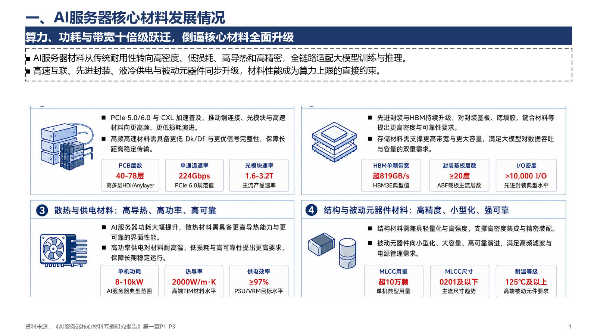
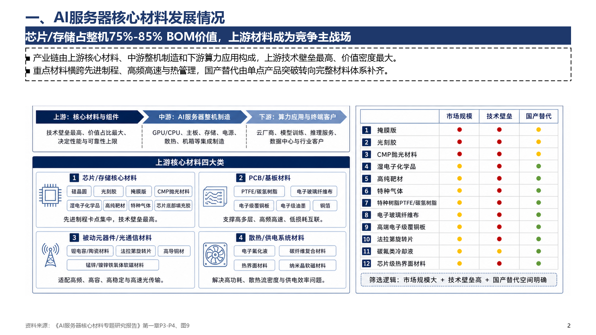
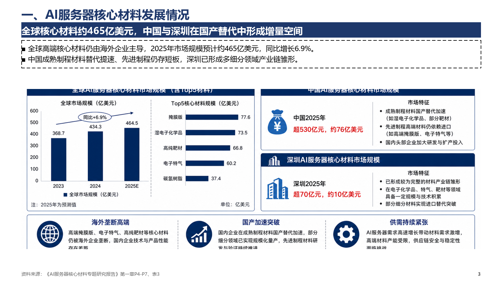

# Standard Report PPT V5.7

双语说明： [中文](#中文说明) · [English](#english)

Standard Report PPT is a Codex skill for turning DOCX, PDF, notes, data, or an existing presentation into an editable, fixed-template consulting PowerPoint deck. V5.7 focuses on analytical blueprint quality, bounded visual accents, deterministic reconstruction, and a shorter post-build QA path.

## Blueprint showcase / 蓝图效果展示

The following three pages were produced from the first chapter (P1–P7) of an AI server materials report. Charts, matrices, text, and cards remain editable; small pictograms are used only as supporting accents.

### S01 — Core material performance / 核心材料性能



### S02 — Value chain and material matrix / 产业链与材料矩阵



### S03 — Market size and regional opportunities / 市场规模与区域机会



---

## 中文说明

### 主要能力

- 两个门禁：用户只需确认最终页数和生成方式，随后直接开始制作。
- 两种模式：`蓝图模式` 用 ImageGen 辅助建立逐页视觉蓝图；`快速模式` 跳过 ImageGen，使用确定性网格快速生成。
- 分析型画布：图表、表格、矩阵、流程和指标条承担主要信息表达。
- 克制的视觉点缀：小图形、Logo、旗帜或示意图仅占正文区域约 6%–12%，并放在独立图标通道中。
- 可编辑输出：文本、数字、表格、图表和基础图形均由 PowerPoint 原生对象重建。
- 确定性编译：整份演示文稿由一个 `generate_deck.py` 构建，避免逐页脚本和随机版式选择。
- 完整质量检查：文字编码、固定骨架、素材完整性和蓝图一致性均有自动审计。
- 精简交付链路：Python 生成后直接渲染目检、复用审计结果、打包并执行交付校验。

### 环境要求

- Windows
- Microsoft PowerPoint 桌面版
- Python 3.12 或兼容版本
- Codex 桌面端或其他能够加载本地 Skill 的 Codex 环境
- 蓝图模式需要可用的 ImageGen；快速模式不需要 ImageGen

### 安装

将仓库克隆到 Codex 技能目录：

```powershell
git clone https://github.com/edchwx-lang/standard-report-ppt.git "$HOME/.codex/skills/standard-report-ppt"
```

### 使用示例

```text
$standard-report-ppt 用这份报告做3页PPT，蓝图模式
$standard-report-ppt 用这份报告做5页PPT，快速模式
```

蓝图模式和快速模式都必须先明确最终页数与生成方式。详细工作流、视觉规则和交付约束见 [SKILL.md](SKILL.md)。

### 验证

```powershell
python -m unittest discover -s tests -p "test_v5_*.py" -q
```

V5.7 发布前回归结果：61 项测试全部通过。一次实际 3 页测试中，Python 生成至交付校验的自动化链路耗时约为：

| 模式 | 自动化链路耗时 |
|---|---:|
| 蓝图模式 | 101.2 秒 |
| 快速模式 | 52.0 秒 |

蓝图模式还需要额外的 ImageGen 与蓝图合成时间，具体耗时取决于模型响应速度。

### 目录结构

```text
standard-report-ppt/
├─ SKILL.md
├─ agents/
├─ assets/
├─ docs/images/
├─ prompts/
├─ references/
├─ scripts/
└─ tests/
```

---

## English

### Key capabilities

- Two intake gates: production begins immediately after the user confirms the final slide count and production mode.
- Two modes: `blueprint` uses ImageGen to create page-specific visual references; `fast` skips ImageGen and uses deterministic body grids.
- Analytical canvas: charts, tables, matrices, flows, and metric strips carry the primary evidence.
- Bounded accents: pictograms, supplied logos, flags, and schematic marks occupy roughly 6%–12% of the body area and stay inside reserved icon lanes.
- Editable output: text, numbers, tables, charts, and primitives are rebuilt as native PowerPoint objects.
- Deterministic compilation: one `generate_deck.py` builds the entire presentation without per-page scripts or random layout cycling.
- Automated QA: text encoding, fixed skeleton geometry, asset completeness, and blueprint fidelity are audited before delivery.
- Short post-build path: build, render, inspect, reuse current audit results, package once, and verify delivery.

### Requirements

- Windows
- Microsoft PowerPoint desktop
- Python 3.12 or a compatible version
- Codex desktop or another Codex environment capable of loading local skills
- Blueprint mode requires ImageGen; fast mode does not

### Installation

Clone the repository into the Codex skills directory:

```powershell
git clone https://github.com/edchwx-lang/standard-report-ppt.git "$HOME/.codex/skills/standard-report-ppt"
```

### Usage examples

```text
$standard-report-ppt Create a 3-slide deck from this report in blueprint mode.
$standard-report-ppt Create a 5-slide deck from this report in fast mode.
```

Both modes require an explicit final slide count and production mode. See [SKILL.md](SKILL.md) for the full workflow, visual contract, and delivery rules.

### Validation

```powershell
python -m unittest discover -s tests -p "test_v5_*.py" -q
```

The V5.7 release passed all 61 regression tests. In one real three-slide validation run, the measured automated path from Python generation through delivery verification took approximately:

| Mode | Automated path |
|---|---:|
| Blueprint | 101.2 seconds |
| Fast | 52.0 seconds |

Blueprint mode also requires ImageGen and blueprint composition time, which varies with model response latency.

### Repository contents

- Skill instructions and agent metadata
- Prompt and visual-system references
- PowerPoint template and deterministic generator runtime
- Pipeline, rendering, audit, and packaging scripts
- V5.1–V5.7 contract regression tests
- Three V5.7 blueprint showcase images

## Notes

- Generated reports and source documents are not included in this repository.
- Users are responsible for verifying that any source material, logos, templates, and generated content may be used in their intended context.

