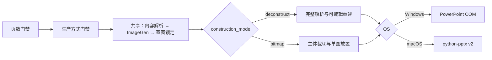

# Standard Report PPT V6.2.3

## V6.2.3 deconstruction output contract

V6.2.3 changes only deconstruction-mode work after formal blueprint locking.
The saved PPTX must inherit the exact company-template slide size, master/layout
inventory, and seed layout; keep the five editable skeleton objects and the
standard black 1 pt dashed core border; and contain no active visual effects on
slides, masters, or layouts. The audit report is hash-bound to acceptance and
cached reuse. Windows PowerPoint COM and the cross-platform macOS python-pptx
path both pass the same output contract.

## V6.2.2 prompt and text-geometry upgrade

V6.2.2 prevents agent-added ImageGen bans on logos, icons, photos, people,
maps, and other visual categories. It also shares the bundled Windows render
environment across both modes and locks deconstruction text boxes to their
literal page-spec geometry.

## V6.2.1 bitmap-only upgrade

V6.2 changes only bitmap-mode work after formal blueprint locking. The first
structurally valid bitmap PPTX is hash-locked and reused; negligible crop gains
are left for manual finishing. Windows and macOS bitmap builds now enforce the
company master/theme/layout, a shared left anchor for the upper three skeleton
layers, and a body picture with no outline, shadow, reflection, glow, or soft
edge. Complete or long partial skeleton-frame remnants at crop edges block the
first build. Pre-blueprint and deconstruction workflows are unchanged.

[中文说明](#中文说明) · [English](#english)

Standard Report PPT 是一个面向 Codex 的固定模板咨询报告 PPT Skill，可将 DOCX、PDF、研究材料、数据、笔记或已有演示文稿转换为可编辑 PowerPoint。

V6 保持蓝图锁定前的内容生产链不变，取消快速模式，新增两种必须显式选择的蓝图后构建方式：较慢但可编辑的解构模式，以及较快、主体不可编辑的位图模式。

## Blueprint showcase / 蓝图效果展示

以下三张蓝图沿用原仓库展示素材。最终 PPT 中的文字、数字、图表、表格和基础图形由本地运行时重建为可编辑对象。

### S01 — Core material performance / 核心材料性能


### S02 — Value chain and material matrix / 产业链与材料矩阵


### S03 — Market size and regional opportunities / 市场规模与区域机会


---

## 中文说明

### V6 生产方式门禁

1. `解构模式（较慢）：逐页拆解蓝图并重建为可编辑 PPT；复杂非原生视觉可保留为局部位图。`
2. `位图模式（较快）：章节、标题、核心判断、来源和页码可编辑；主体蓝图裁切后作为不可编辑图片放入。`

两种方式都必须调用 ImageGen、逐页锁定正式蓝图；ImageGen 不可用时停止，不允许位图模式绕过蓝图，也不允许解构模式自动降级。Windows 使用 `windows_com_v584`，macOS 使用 `mac_python_pptx_v2`。两端解构模式在蓝图锁定后共同执行 G0–G3 视觉普查、全页和 Q1–Q4 审查、原子级局部裁切及图片无轮廓门禁；Mac 另外阻断裁切像素中的完整深色外围框线。

### V6.0.0-rc1 最新状态

- Mac 解构模式现已强制执行 G0–G3 视觉普查、全页和 Q1–Q4 哈希绑定审查，并拒绝包含多主体、可编辑文字或原生几何的大块复合裁切。
- Windows 与 Mac 解构成品都会审计图片轮廓；Mac 编译器还会阻断裁切 PNG 中已经烘焙进去的完整深色外围框线。
- 位图模式继续保留五层原生可编辑骨架，每页仅放置一个等比例、无轮廓的主体图片；核心判断每段严格只有一个 `■`。
- 发布源已完成 422 项自动化测试，包括真实 Windows PowerPoint COM 构建和 Mac/python-pptx 结构构建；蓝图生成前冻结链路未改变。
- 当前仍为 RC：真实 PowerPoint for Mac 冒烟测试尚未完成，因此尚未标记正式 `V6.0.0`。



### 平台运行路径

#### Windows

运行路径：

```text
统一内容与蓝图
  → 平台无关 page_specs
  → windows_com_v584
  → Microsoft PowerPoint COM 构建
  → PowerPoint 渲染
  → 审计与三文件交付包
```

要求：

- Windows 10/11
- Microsoft PowerPoint 桌面版
- Python 3.12
- Codex 桌面端或其他可加载本地 Skill 的 Codex 环境
- 蓝图模式需要可用的 ImageGen

Windows 安装：

```powershell
git clone --branch main --single-branch https://github.com/edchwx-lang/standard-report-ppt.git "$HOME\.codex\skills\standard-report-ppt"
```

如目录已存在：

```powershell
git -C "$HOME\.codex\skills\standard-report-ppt" switch main
git -C "$HOME\.codex\skills\standard-report-ppt" pull --ff-only origin main
```

#### macOS（V6 默认路径）

运行路径：

```text
统一内容与蓝图
  → 平台无关 page_specs
  → mac_python_pptx_v2
  → python-pptx 本地构建
  → PowerPoint for Mac 渲染（优先）或 LibreOffice 回退
  → 审计与三文件交付包
```

macOS 不使用 PowerPoint COM。要求：

- macOS
- Python 3.12
- PowerPoint for Mac，或用于回退渲染的 LibreOffice
- Codex 桌面端或其他可加载本地 Skill 的 Codex 环境
- V6 解构模式和位图模式都需要可用的 ImageGen

macOS 安装：

```bash
git clone --branch main --single-branch https://github.com/edchwx-lang/standard-report-ppt.git "$HOME/.codex/skills/standard-report-ppt"
```

如目录已存在：

```bash
git -C "$HOME/.codex/skills/standard-report-ppt" switch main
git -C "$HOME/.codex/skills/standard-report-ppt" pull --ff-only origin main
```

如果 PowerPoint for Mac 和 LibreOffice 均不可用，管线可生成结构有效但未渲染验证的本地 PPTX；此状态不会生成已验证的三文件 ZIP。

### 使用方式

```text
$standard-report-ppt 用这份报告做3页PPT，解构模式
$standard-report-ppt 用这份报告做5页PPT，位图模式
```

也可以先提供材料，再按提示选择：

```text
1. 解构模式（较慢）：逐页拆解蓝图并重建为可编辑 PPT；复杂非原生视觉可保留为局部位图。
2. 位图模式（较快）：章节、标题、核心判断、来源和页码可编辑；主体蓝图裁切后作为不可编辑图片放入。
```

最终页数和生产方式是仅有的常规用户确认。V6 两种方式都必须先完成内容解析和 ImageGen 蓝图锁定；单独选择“蓝图模式”无效。完整合同、视觉规则和交付要求见 [SKILL.md](SKILL.md)。

### 项目管线命令

以下命令用于调试或手动运行已经准备好的项目；普通 Codex 使用无需逐条执行：

```powershell
python scripts/project_pipeline.py <project> --init
python scripts/project_pipeline.py <project> --materialize
python scripts/project_pipeline.py <project> --prepare-visual-review
# 位图模式改用：
python scripts/project_pipeline.py <project> --prepare-bitmap-review
python scripts/project_pipeline.py <project> --compile
python scripts/project_pipeline.py <project> --run --output <project>/output/report.pptx
```

`--prepare-visual-review` 用于 V6 解构模式，在正式蓝图锁定后生成全页与 Q1–Q4 哈希绑定审查；V6 位图模式必须使用 `--prepare-bitmap-review`，只做逐页全图审查。

Windows 外部端到端冒烟已验证 V6 解构、位图两种模式均可由 PowerPoint COM 成功构建。真实 PowerPoint for Mac 冒烟通过前，版本仍标记为 `V6.0.0-rc1`。

### 验证

```powershell
python -m unittest discover -s tests -p "test_*.py"
```

V6 发布回归包含 Windows/macOS 后端测试、蓝图锁定测试、裁剪合同测试和最终 PPT 资产审计。

### 目录结构

```text
standard-report-ppt/
├─ SKILL.md
├─ agents/
├─ assets/
├─ docs/images/
├─ prompts/
├─ references/
├─ scripts/
├─ tests/
├─ requirements-windows.lock
└─ requirements-macos.lock
```

---

## English

### V6 construction gate

Every new V6 project must explicitly select one of these post-blueprint routes:

1. Deconstruct (slower): parse each blueprint and rebuild an editable PPT; one
   bounded local bitmap may remain for a genuinely non-native visual subject.
2. Bitmap (faster): keep chapter, title, core judgment, source, and page number
   editable, then place one reviewed cropped body image.

Both routes require built-in ImageGen and one immutable blueprint per page.
Windows uses `windows_com_v584`; macOS uses `mac_python_pptx_v2`. No route may
silently switch to the other.

### Latest V6.0.0-rc1 status

- Mac deconstruction now enforces the G0–G3 visual census and hash-bound full-page plus Q1–Q4 review, and rejects composite crops containing multiple subjects, editable text, or native geometry.
- Both deconstruction backends audit picture outlines. The Mac compiler also blocks a complete dark perimeter frame already baked into a cropped PNG.
- Bitmap construction retains five native editable skeleton layers and inserts exactly one aspect-preserving, outline-free body image per page. Every core-judgment paragraph contains exactly one `■`.
- The release source passes 422 automated tests, including a real Windows PowerPoint COM build and the Mac/python-pptx structural build. All frozen pre-blueprint stages remain unchanged.
- This remains an RC: the real PowerPoint for Mac smoke test remains pending, so the release is not yet labeled final `V6.0.0`.

### Windows path

```text
Shared content and blueprint
  → platform-neutral page_specs
  → windows_com_v584
  → Microsoft PowerPoint COM build and render
  → audits
  → PPTX + blueprints.zip + py.zip
```

Requirements: Windows 10/11, Microsoft PowerPoint desktop, Python 3.12, a Codex environment that can load local skills, and ImageGen for both V6 construction modes.

```powershell
git clone --branch main --single-branch https://github.com/edchwx-lang/standard-report-ppt.git "$HOME\.codex\skills\standard-report-ppt"
```

To update an existing installation:

```powershell
git -C "$HOME\.codex\skills\standard-report-ppt" switch main
git -C "$HOME\.codex\skills\standard-report-ppt" pull --ff-only origin main
```

### macOS path (V6 default)

```text
Shared content and blueprint
  → platform-neutral page_specs
  → mac_python_pptx_v2
  → local python-pptx build
  → PowerPoint for Mac render or LibreOffice fallback
  → audits
  → PPTX + blueprints.zip + py.zip
```

macOS never uses PowerPoint COM. Requirements: macOS, Python 3.12, PowerPoint for Mac or LibreOffice for rendering, a Codex environment that can load local skills, and ImageGen for both V6 construction modes.

```bash
git clone --branch main --single-branch https://github.com/edchwx-lang/standard-report-ppt.git "$HOME/.codex/skills/standard-report-ppt"
```

To update an existing installation:

```bash
git -C "$HOME/.codex/skills/standard-report-ppt" switch main
git -C "$HOME/.codex/skills/standard-report-ppt" pull --ff-only origin main
```

Without either renderer, the pipeline may produce a structurally valid local PPTX, but it will not issue the verified three-entry ZIP.

### Usage

```text
$standard-report-ppt Create a 3-slide V6 deck, then use deconstruct construction after locking the blueprints.
$standard-report-ppt Create a 5-slide V6 deck and use bitmap construction after locking the blueprints.
```

See [SKILL.md](SKILL.md) for the complete production contract and delivery rules.

### Validation

```bash
python -m unittest discover -s tests -p "test_*.py"
```

The V6 regression suite covers both platform backends, immutable blueprint locking, mandatory crop contracts, and final PPT asset auditing.

## Notes

- Generated reports and source documents are not included in this repository.
- Users are responsible for verifying that source material, logos, templates, and generated content may be used in their intended context.
